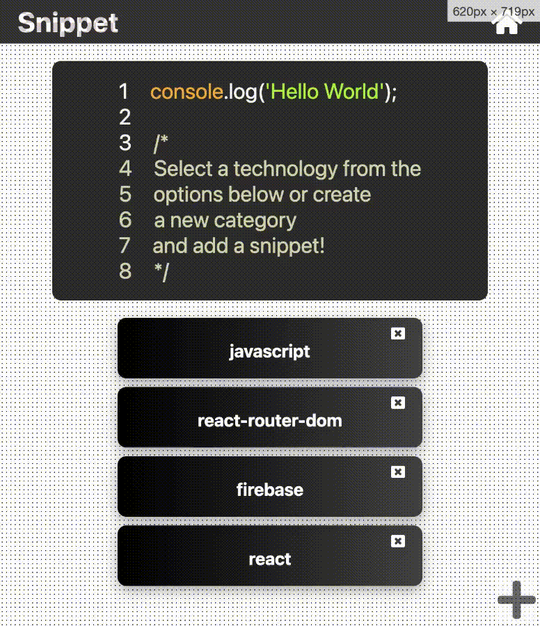

# Snippet

A web app that lets you upload and save frequently used code snippets for later use! Allows addition and deletion of categories and code blocks that are stored and queried from a firebase database.

### Live Version:

[Visit Snippet](https://rcamach7.github.io/snippet/)



### Built Using:

- [React Framework](https://reactjs.org/)
  - Functional Components
  - State and Props
  - useEffect Hook
  - react router dom
    - routes
    - browser router
    - url parameter querying
- [Firebase BAAS](https://firebase.google.com/)
  - Add to database
  - Delete from database
  - Read from database
- [React Syntax Highlighter](https://github.com/react-syntax-highlighter/react-syntax-highlighter)
- SASS Styling
- [Font Awesome Icons](https://fontawesome.com/)
- Javascript
  - Data Manipulation
- HTML
  - From Validation
  - Consistent Semantic Elements
- CSS
  - Animations

#### Local Installation & Running

```bash
git clone https://github.com/rcamach7/snippet.git
cd snippet
npm install
npm run start
```

### Future Improvements

- Add drop down to each tech collection and snippet component for ability to delete or edit.
